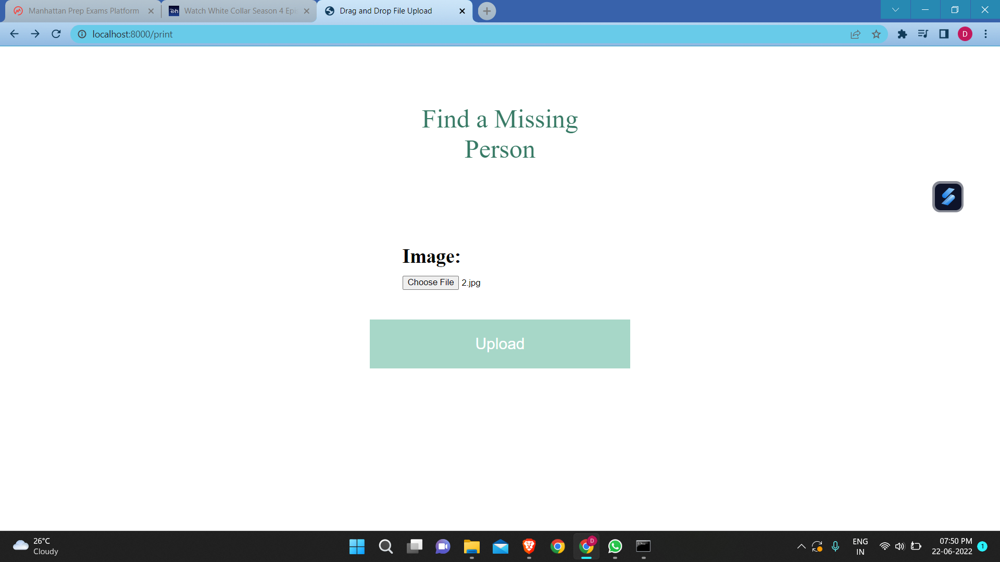
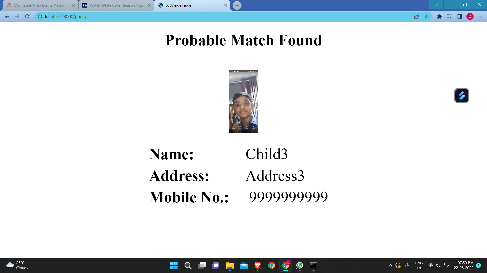

# Lost-Angel-Investigator

***
This model has got 76.81% accuracy on this validation dataset.
***

***
CroppedDataset.zip is zipped file for dataset.

Database of approximately 400 child images collected from internet.
The children in these images ARE NOT ACTUALLY LOST ONES.
Images are used just to train the model on dummy data because we could not get real data of lost children due to security and privacy issues.
***

***
Installation Process
 
1. First clone git repository. 
Write command in cmd  
command - git clone https://github.com/DakshKothari18/HackathonWCE

2. Change directory to this folder  
command - cd HackathonWCE   

3. Create a Virtual Environment  
	- pip install virtualenvwrapper-win  
	- mkvirtualenv project

4. Activate the Virtual Environment  
command - workon project  

5. Install Dependencies/Packages  
command - pip install -r requirements.txt  

6. Change directory to folder Frontend (Django)  
command - cd "Frontend (Django)"  

7. Make Migrations and Migrate  
command - python manage.py makemigrations  
command - python manage.py migrate  

8. Run the project  
command - python manage.py runserver  
***

***
Demonstration
Extract the zip file CroppedDataset.zip  

After running the project.   
Go to localhost:8000/print  
 
Upload the image of child from Dataset  

Click Upload  
</img>
See the results.  
</img>
***

 

